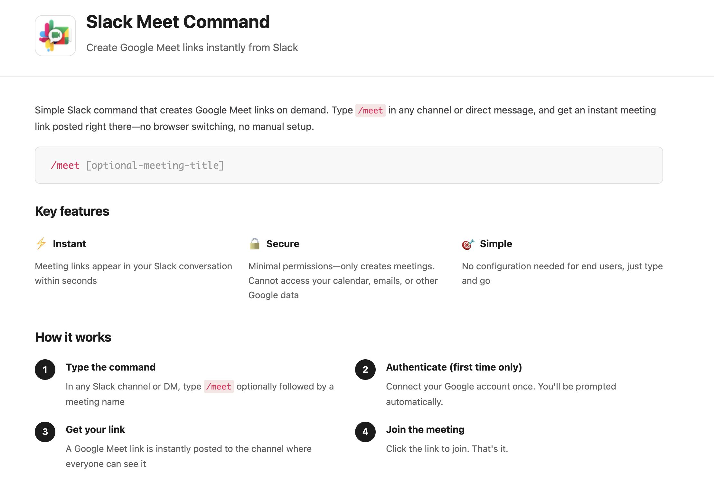

# Slack Meet Command

A Ruby/Sinatra application that creates Google Meet links via Slack slash commands.

<p align="center">
  <a href="https://slack-meet-command.signorini.dev">
    
  </a>
</p>

<p align="center">
  <a href="https://slack-meet-command.signorini.dev">Homepage</a>
</p>

## Features

- **Instant Meeting Creation**: Type `/meet` in Slack to instantly create a Google Meet link
- **Custom Meeting Names**: Add a name like `/meet standup` for easy identification
- **Configurable Settings**: Control access, transcription, recording, and more
- **Multi-Tenant OAuth**: Each user authenticates with their own Google account
- **Secure**: Slack signature verification and proper OAuth flows

## Quick Start

### Prerequisites

- Ruby 3.2+
- SQLite 3.x
- Google Cloud account
- Slack workspace (admin access)

### Local Development

1. **Clone and setup**:
   ```bash
   git clone <repository>
   cd slack-meet-command
   cp .env.example .env
   ```

2. **Configure environment** (edit `.env`):
   ```bash
   SLACK_SIGNING_SECRET=<from Slack app>
   GOOGLE_CLIENT_ID=<from Google Cloud>
   GOOGLE_CLIENT_SECRET=<from Google Cloud>
   SESSION_SECRET=<generate with: ruby -e "require 'securerandom'; puts SecureRandom.hex(64)">
   ```

3. **Install dependencies**:
   ```bash
   bundle install
   ```

4. **Run migrations**:
   ```bash
   bundle exec rake db:migrate
   ```

5. **Start server**:
   ```bash
   bundle exec puma -C config/puma.rb
   ```

6. **Run tests**:
   ```bash
   bundle exec rake test
   ```

## Configuration

Edit `config.json` to customize meeting defaults:

```json
{
  "access_type": "TRUSTED",
  "auto_transcribe": false,
  "auto_record": false,
  "smart_notes": false,
  "moderation": "OFF"
}
```

Options:
- **access_type**: `OPEN`, `TRUSTED`, or `RESTRICTED`
- **auto_transcribe**: Enable auto-transcription (requires Google Workspace)
- **auto_record**: Enable auto-recording (requires Google Workspace)
- **smart_notes**: Enable AI-generated notes (requires Google Workspace)
- **moderation**: `OFF` or `ON`

Environment variables override config.json:
- `MEET_ACCESS_TYPE`
- `MEET_AUTO_TRANSCRIBE`
- `MEET_AUTO_RECORD`
- `MEET_SMART_NOTES`
- `MEET_MODERATION`

## Deployment

See [DEPLOYMENT.md](DEPLOYMENT.md) for complete deployment instructions to Fly.io.

## Architecture

- **Web Framework**: Sinatra with Puma
- **Database**: SQLite with Sequel ORM
- **APIs**: Google Meet REST API, Slack API
- **Authentication**: OAuth 2.0 for Google
- **Deployment**: Fly.io (containerized)

## Project Structure

```
slack-meet-command/
├── app/                      # Application code
│   ├── models/               # Database models
│   └── services/             # Business logic
├── lib/                      # Libraries and utilities
├── db/                       # Database migrations
├── test/                     # Test suite
├── config/                   # Configuration files
├── requirements/             # Requirement specifications
└── app.rb                    # Main application file
```

## Development

### Running Tests

```bash
# All tests
bundle exec rake test

# Specific test file
bundle exec ruby test/requirements/core/req_001_create_meet_link_test.rb

# With verbose output
bundle exec rake test TESTOPTS="--verbose"
```

### Linting

```bash
bundle exec rubocop
```

### Database

```bash
# Run migrations
bundle exec rake db:migrate

# Reset database (development only)
rm db/development.sqlite3
bundle exec rake db:migrate
```

## Documentation

- [DEPLOYMENT.md](DEPLOYMENT.md) - Complete deployment guide
- [requirements/](requirements/) - Detailed requirements documentation
- [test/README.md](test/README.md) - Testing guide
- [specs.md](specs.md) - Complete implementation specification

## Security

- All Slack requests are verified using HMAC-SHA256 signatures
- OAuth tokens are stored securely in the database
- HTTPS required for all external communication
- Token refresh handled automatically

## Troubleshooting

### Common Issues

1. **"Invalid signature" error**
   - Verify SLACK_SIGNING_SECRET matches your Slack app

2. **"Not authenticated" after OAuth**
   - Check GOOGLE_CLIENT_ID and GOOGLE_CLIENT_SECRET
   - Ensure redirect URI matches exactly

3. **Database errors**
   - Run `bundle exec rake db:migrate`
   - Check DATABASE_URL is correct

### Logs

Development logs are human-readable. Production logs are JSON formatted.

```bash
# View logs locally
tail -f log/development.log

# View Fly.io logs
fly logs
```

## Contributing

1. Follow the existing code style
2. Add tests for new features
3. Ensure all tests pass: `bundle exec rake test`
4. Run linter: `bundle exec rubocop`
5. Document public APIs with YARD comments

## License

[Your License Here]

## Support

For issues and questions:
- Check [DEPLOYMENT.md](DEPLOYMENT.md) troubleshooting section
- Review [requirements/](requirements/) documentation
- Check application logs
